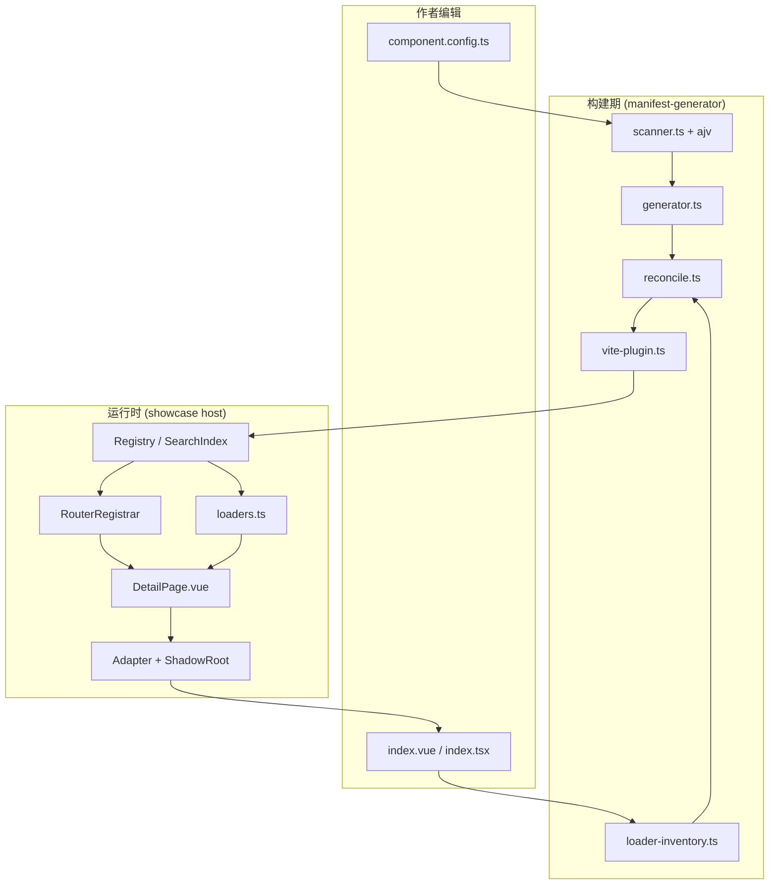
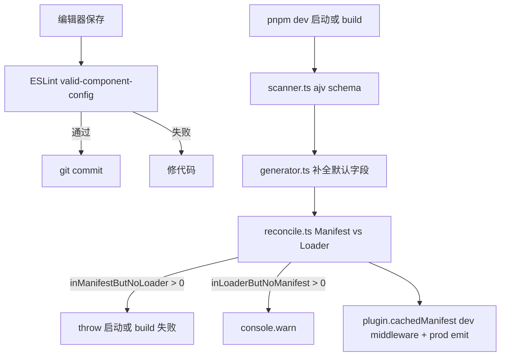

# Component Protocol —— 契约图

> 给读 `types.ts` / `*.schema.json` 之前的新人看。一图讲清"组件从声明到运行"的全链路 + 哪些字段已闭合 / 哪些是历史遗留 / 哪些是 dev-only。
>
> **标注约定**: ✅ 已闭合 · ⚠️ 声明但未完全生效 · 🟡 历史遗留(未来收敛) · 🔵 dev-only(不进生产)

## 1. 全链路数据流

## 2. ComponentConfig 字段状态

> 23 个顶层字段(加新 `api` 后)。每个字段的真实状态:

| 字段 | 类型 | 状态 | 说明 |
|---|---|---|---|
| `id` | string | ✅ | ajv 校验 + ESLint `valid-component-config` 校验 id === 目录名 |
| `name` | string | ⚠️ | manifest 透传,无消费者 |
| `title` | string | ✅ | 卡片 / 详情页标题 |
| `description` | string | ⚠️ | manifest 透传,搜索字段之一,但 UI 渲染不完整 |
| `version` | string | ⚠️ | ajv 只 pattern 兜底,无完整 SemVer 校验 |
| `framework` | Framework | ✅ | ajv enum + ESLint 校验 framework === 所在包 |
| `entry` | string | 🟡 | **冲突点**:声明 entry 但 loader glob 只认 index.vue / index.tsx。详见 framework-architecture-review §5 P1#3 |
| `group` | string | ✅ | slug 化后做 ManifestGroup.id(中文 fallback 见 §4.1) |
| `category` | string | ⚠️ | 收集到 ManifestGroup.categories,无单独消费者 |
| `tags` | string[] | ✅ | 搜索字段 |
| `platform` | Platform | ⚠️ | HomePage 过滤卡片,但当前 showcase 未实现 |
| `status` | enum | ⚠️ | 透传,无 UI 区分 |
| `preview` | PreviewConfig | ⚠️ | 透传,卡片缩略图占位策略未完整接入 |
| `route` | RouteConfig | ⚠️ | path 校验,query/keepAlive/hidden/icon/order 无消费者 |
| `mount` | MountConfig | 🟡 | **多字段未消费**:exportName/propsMode/eventPrefix/requiresReactRoot/unmountTimeoutMs |
| `isolation` | IsolationConfig | 🟡 | **mode 没真生效** —— DetailPage 总创建 ShadowRootHost,不读 mode |
| `theme` | ThemeConfig | 🟡 | 构造时注入 ShadowRoot,但 Adapter 不消费 MountContext.theme |
| `props` | PropsConfig | ⚠️ | 透传,无消费者 |
| `dependencies` | DependencyConfig[] | ⚠️ | 透传,无消费者 |
| `capabilities` | CapabilityConfig | ⚠️ | fullscreen/resizable 透传,Host 未做能力闸门 |
| `docs` | DocsConfig | ⚠️ | 透传,无消费者 |
| `loaderUrl` | string | ✅ | loaders.ts setLoaders 优先用它覆盖 glob |
| **`api`** | ApiRule array or Record | 🔵 | **dev-only**。vite-plugin 在 buildStart 扫描 → 喂给 mfeDynamicProxy → 不进 manifest → 不进生产 |

## 3. ManifestEntry 字段(构建产物)

| 字段 | 状态 | 说明 |
|---|---|---|
| `id` `name` `title` `description` `version` `framework` `group` `category` `tags` `status` `platform` `preview` `route` `mount` `isolation` `theme` `capabilities` | ✅ | 从 ComponentConfig 透传或默认值补全 |
| `loaderKey` | ✅ | = id,详情页 loaders 用 |
| `loaderUrl` | ✅ | 透传 |
| `assets.entryChunk` | ⚠️ | **不可信**:写死 `assets/<id>.js`,但 Vite 实际产物是 `vc-<id>-<hash>.js`。`resolveAssetUrl` 未传 |
| `assets.cssChunks` | ⚠️ | 永远是空数组,无消费者 |

> 详见 framework-architecture-review §5 P1#8。

## 4. 已知边界与 trade-off

### 4.1 中文 group → 丑 slug

`generator.ts` 在 group 是纯中文时退化到 `group-${hash8}-${len}`(如 `group-1f3a8b2c-4`)。引入 pinyin 会增加契约包运行依赖,工程上不可接受。**当前 trade-off 合理**:UI 主要展示 group title,slug 只作内部 key。

### 4.2 `entry` 字段不可信

ComponentConfig 写 `entry: './index.tsx'`,但 loader glob 仍写死 `index.{vue,tsx}`。两种修法(详见审计文档 §5 P1#3 方案 A/B),本协议不站队。

### 4.3 IsolationMode 三档没真分流

`DetailPage.vue` 不读 `entry.isolation.mode`,总创建 ShadowRootHost。`css-module` 和 `global` 声明即静默忽略。

### 4.4 dev-only 字段

- `ComponentConfig.api` → 仅 mfeDynamicProxy 用,见 [[component-level-dev-proxy]]
- `componentRoots` 是 vite plugin 配置,不进 config

## 5. 校验链:谁负责什么

## 6. 维护规则

### 加新字段前

1. **有真实消费者吗?** 没有 → 不加,或加到 `loaderUrl` / `api` 这种 dev-only 旁路
2. **有 ajv schema + ESLint 校验吗?** 没有 → 至少补 ajv
3. **ManifestEntry 是否透传?** 如果只给构建期用,**不要透传**(避免扩大 manifest)
4. **会触发构建期阻断吗?** 不变量要阻断(throw),警告用 console.warn

### 改字段前

1. 同步改 `types.ts` + `component-config.schema.json` + 任何 manifest schema
2. 跑 `pnpm lint` 看 ESLint 闸门是否挡住
3. 跑 `pnpm dev` 看对账是否一致
4. 看 `apps/showcase/dist/component-manifest.json` 看产物是否漂移

## 7. 关联文档

- 审计与 P0/P1/P2 完整清单: `docs/architecture/framework-architecture-review.md`
- 对账机制已落地: `docs/architecture/manifest-loader-reconciliation.md`
- Dev-only proxy 模式: [[component-level-dev-proxy]]
- 加组件教程: [[how-to-add-component]]
- 类型契约源: `packages/component-contract/src/types.ts`
- JSON Schema: `packages/component-contract/src/{component-config,manifest}.schema.json`